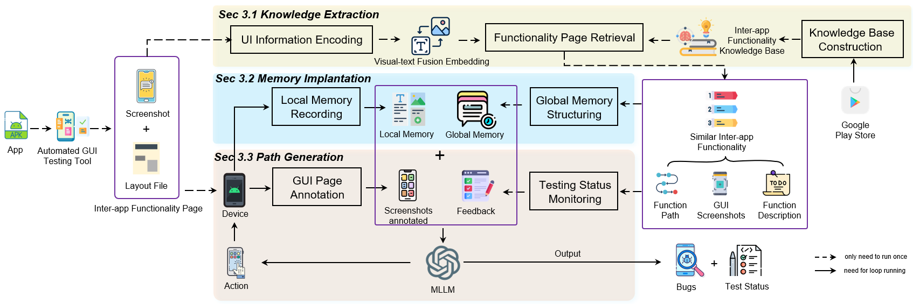
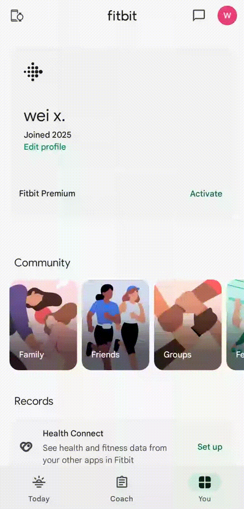

# InterDroid

Official implementation of the paper _"Memory Shapes Reality: Implanting Knowledge into Memory to Make LLM Achieving Inter-app Function Testing"_

## 📖 Overview
InterDroid is an automated GUI testing approach that enhances inter-app functionality testing by implanting structured semantic knowledge into LLM's memory. Our method addresses key challenges in cross-application testing through:

🔍 **Multimodal Knowledge Retrieval**  
🔄 **Memory Implantation Mechanism**  
📊 **Dynamic Testing Monitor**  
🧩 **Seamless Integration** with existing testing tools

  
*Figure: InterDroid Architecture*

## 🚀 Key Features
- Cross-application Testing Automation
- Visual-textual GUI understanding
- Global & Local memory implantation
- Real-time testing path generation
- Open-world scenario adaptation
- Crash bug detection capabilities

## 🛠️ Getting Started

### Prerequisites
- Android Studio with AVD or physical Android device
- Python 3.10+
- CUDA-compatible GPU (recommended)

### Quick Start

1. Setup environment:
```bash
conda create -n interdroid python=3.10
conda activate interdroid
pip install -r requirements.txt
```

2. Configure settings in `config.py`

3. Run InterDroid:
```bash
python main.py
```

For detailed setup instructions and configuration options, see [Code Documentation](Code/README.md).

## 🛠️ Code

We provide the code for our dataset collection tool in [dataset_collection_tool](Code/dataset_collection_tool/README.md).

And the code for InterDroid is in [InterDroid Code](Code/interdroid/README.md).

Refer to our [Code](Code/README.md) page for more details.

## 📦 Dataset

Our dataset contains three main components:
- Benchmark Dataset: Test cases for evaluation
- Knowledge Base Dataset: Training data
- Complete Inter-app Dataset: Full collection of records

The datasets are organized as follows:

```
Dataset (Benchmark/Knowledge_Base/Inter-app Dataset)
|-- 1
|   |-- record_1.zip
|   |   |-- record.json
|   |   |-- screenshots
|   |   |   |-- step_0.png
|   |   |   |-- step_1.png
|   |   |   `-- ...
|   |   `-- ui_trees
|   |       |-- step_0_ui.xml
|   |       |-- step_1_ui.xml
|   |       `-- ...
|   |-- record_2.zip
|   |   |-- (same structure as above)
|   |   `-- ...
|   `-- 1.apk
|-- 2
|   |-- record_1.zip
|   |   |-- (same structure as above)
|   |   `-- ...
|   `-- 2.apk
|-- ...
```

Refer to our [Dataset](Dataset/README.md) page for more details.

## 📊 Benchmark

Our benchmark suite consists of:

- **Inter-app Test Cases**: 200+ carefully designed test scenarios covering various inter-app interactions
- **Reference Solutions**: Expert-validated interaction sequences for each test case
- **Evaluation Metrics**: Standardized metrics for measuring testing performance
- **Ground Truth Data**: Annotated expected behaviors and outcomes

The benchmark is structured the same as the Inter-app Dataset.

For detailed benchmark information and usage guidelines, see [Benchmark Documentation](Benchmark/README.md).

## 📈 Experiments Results

### RQ1: Testing Path Accuracy & Coverage  
InterDroid significantly outperformed state-of-the-art baselines in inter-app functionality testing:  

| Metric               | InterDroid | Best Baseline (VisionDroid) | Improvement |
|----------------------|------------|-----------------------------|-------------|
| **Page Coverage**    | 0.84       | 0.36                        | **133% ↑**  |
| **Action Coverage**  | 0.85       | 0.38                        | **124% ↑**  |
| **Exact Match (EM)** | 0.70       | 0.19                        | **268% ↑**  |
| **Time/Test**        | 7.1 min    | 17.3 min (GPTDroid)         | **59% ↓**   |
| **Cost/Test**        | $0.56      | $1.14 (VisionDroid)         | **51% ↓**   |

Key advantages:  
• Reduced semantic ambiguity using historical interaction patterns  
• Maintained task-aware context across app transitions  
• Avoided 92% of permission/authorization errors in sensitive scenarios  

This are examples of our method InterDroid test app approach:

 


### RQ2: Ablation Study  
Critical contributions of modules:  

| Removed Component       | Performance Drop |  
|-------------------------|------------------|  
| **Memory Implanting**   | EM ↓67% (0.70→0.23) |  
| **Global Memory**        | Page Coverage ↓41% (0.84→0.49) |  
| **Local Memory**         | Action Coverage ↓40% (0.85→0.51) |  
| **Knowledge Extraction** | Time ↑84% (7.1→13.1 min) |  

Key findings:  
• Multimodal encoding improved retrieval accuracy by 38% vs text-only  
• Testing Monitor prevented 76% of path deviations  

---

### RQ3: Real-World Bug Detection  

Tested on **180 Google Play apps** with 100K+ downloads:  

| Result              | Count |  
|---------------------|-------|  
| **New Crash Bugs**  | 43    |  
| **Fixed Bugs**      | 31    |  
| **Confirmed Bugs**  | 12    |  
| **Rejected Reports**| 0     |  

Failure analysis showed:  
• 68% errors occurred during app transition states  
• 22% involved permission handling across apps  
• 10% stemmed from third-party service integration  


#### All New Bugs Found

| ID | App name       | Category  | Download number | Version  | Status    |
|----|----------------|-----------|-----------------|----------|-----------|
| 1  | Agoda          | Travel    | 50M+            | 13.8.0   | Fixed     |
| 2  | Strava         | Health    | 50M+            | 10.3     | Fixed     |
| 3  | ShortMax       | Enter     | 50M+            | 2.0.9    | Fixed     |
| 4  | Wattpad        | Book      | 50M+            | 11.2.0   | Fixed     |
| 5  | BeautyCam      | Photo     | 50M+            | 12.5.35  | Fixed     |
| 6  | Yelp           | Food      | 50M+            | 25.11    | Fixed     |
| 7  | maxim          | Map       | 50M+            | 11.2     | Fixed     |
| 8  | Cheapflights   | Travel    | 10M+            | 224.1    | Fixed     |
| 9  | KAYAK          | Travel    | 10M+            | 225.2    | Fixed     |
| 10 | SimpleCalen    | Product   | 10M+            | 6.1.0    | Fixed     |
| 11 | Easy Notes     | Product   | 10M+            | 1.2.98   | Fixed     |
| 12 | HelloTalk      | Education | 10M+            | 6.0.6    | Fixed     |
| 13 | MMEBudget      | Finance   | 10M+            | 4.9.27   | Fixed     |
| 14 | MMWbO          | Health    | 10M+            | 25.2.0   | Cofirmed  |
| 15 | MMWbO          | Health    | 10M+            | 25.2.0   | Fixed     |
| 16 | ASICS          | Health    | 10M+            | 15.23    | Fixed     |
| 17 | SportsTracker  | Health    | 10M+            | 5.0.1    | Fixed     |
| 18 | Deliveroo      | Food      | 10M+            | 3.215    | Fixed     |
| 19 | Webex          | Business  | 10M+            | 45.2.0   | Fixed     |
| 20 | PinterestLite  | Social    | 10M+            | 1.8.0    | Fixed     |
| 21 | KiKUU          | Shop      | 10M+            | 30.1.6   | Fixed     |
| 22 | Lalamove       | Map       | 10M+            | 112.9    | Cofirmed  |
| 23 | GrabDriver     | Map       | 10M+            | 5.375.0  | Cofirmed  |
| 24 | Trainline      | Map       | 10M+            | 339.1.0  | Cofirmed  |
| 25 | eDreams        | Travel    | 10M+            | 4.1050.0 | Cofirmed  |
| 26 | eDreams        | Travel    | 10M+            | 4.1050.0 | Cofirmed  |
| 27 | MEXC           | Finance   | 5M+             | 9.2.1    | Fixed     |
| 28 | Gate.io        | Finance   | 5M+             | 6.52.1   | Fixed     |
| 29 | Sketchbook     | Art       | 5M+             | 6.10.0   | Fixed     |
| 30 | Cash Book      | Business  | 5M+             | 164      | Fixed     |
| 31 | Manta          | Book      | 5M+             | 25.3     | Fixed     |
| 32 | Thuisbezorgd   | Food      | 5M+             | 10.49.0  | Cofirmed  |
| 33 | NS             | Travel    | 5M+             | 8.17.2   | Cofirmed  |
| 34 | Cash Book      | Business  | 5M+             | 165      | Cofirmed  |
| 35 | MTR            | Travel    | 1M+             | 2.2.1    | Fixed     |
| 36 | 9Weather       | Weather   | 1M+             | 1.134.1  | Fixed     |
| 37 | HungryPanda    | Food      | 1M+             | 8.55.6   | Fixed     |
| 38 | Cisco          | Commun    | 1M+             | 15.0.4   | Fixed     |
| 39 | TADA           | Map       | 1M+             | 153      | Cofirmed  |
| 40 | Coolblue       | Shop      | 1M+             | 2.0.217  | Cofirmed  |
| 41 | Income Expense | Finance   | 1M+             | 242      | Cofirmed  |
| 42 | BEA            | Finance   | 500K+           | 10.0.1   | Fixed     |
| 43 | HighSpeedRail  | Travel    | 100K+           | 1.3.5    | Fixed     |


#### Comparison of Tools With and Without Our Method Integration

| ID | App name      | Status | TimeMachine w/o InterDroid | ComboDroid w/o InterDroid | APE+QT w/o InterDroid | Humanoid w/o InterDroid | VisionDroid w/o InterDroid | TimeMachine wtih InterDroid | ComboDroid wtih InterDroid | APE+QT with InterDroid | Humanoid wtih InterDroid | VisionDroid with InterDroid  |
|----|---------------|--------|----------------------------|---------------------------|-----------------------|-------------------------|----------------------------|-----------------------------|----------------------------|------------------------|--------------------------|------------------------------|
| 1  | Agoda         | Fixed  |                            |                           |                       |                         |                            | $\checkmark$                |                            |                        | $\checkmark$             | $\checkmark$                 |
| 2  | Strava        | Fixed  |                            |                           |                       |                         |                            |                             | $\checkmark$               | $\checkmark$           | $\checkmark$             | $\checkmark$                 |
| 3  | ShortMax      | Fixed  |                            |                           |                       |                         | $\bigstar$                 | $\checkmark$                | $\checkmark$               | $\checkmark$           |                          | $\checkmark$                 |
| 4  | Wattpad       | Fixed  |                            |                           |                       |                         |                            |                             |                            | $\checkmark$           | $\checkmark$             | $\checkmark$                 |
| 5  | BeautyCam     | Fixed  |                            | $\bigstar$                |                       | $\bigstar$              | $\bigstar$                 | $\checkmark$                | $\checkmark$               | $\checkmark$           | $\checkmark$             | $\checkmark$                 |
| 6  | Yelp          | Fixed  |                            |                           |                       |                         |                            |                             |                            |                        |                          |                              |
| 7  | maxim         | Fixed  |                            |                           |                       |                         |                            |                             | $\checkmark$               | $\checkmark$           | $\checkmark$             | $\checkmark$                 |
| 8  | Cheapflights  | Fixed  | $\bigstar$                 |                           |                       | $\bigstar$              |                            | $\checkmark$                | $\checkmark$               |                        | $\checkmark$             | $\checkmark$                 |
| 9  | KAYAK         | Fixed  |                            |                           |                       |                         |                            |                             |                            |                        |                          | $\checkmark$                 |
| 10 | SimpleCalen   | Fixed  |                            |                           |                       |                         |                            | $\checkmark$                |                            | $\checkmark$           | $\checkmark$             | $\checkmark$                 |
| 11 | Easy Notes    | Fixed  |                            |                           |                       |                         |                            |                             |                            | $\checkmark$           |                          |                              |
| 12 | HelloTalk     | Fixed  |                            |                           | $\bigstar$            |                         | $\bigstar$                 |                             | $\checkmark$               | $\checkmark$           | $\checkmark$             | $\checkmark$                 |
| 13 | MMEBudget     | Fixed  |                            |                           |                       |                         |                            | $\checkmark$                |                            |                        |                          |                              |
| 14 | MMWbO         | Fixed  |                            |                           |                       |                         |                            |                             |                            |                        | $\checkmark$             | $\checkmark$                 |
| 15 | ASICS         | Fixed  |                            |                           | $\bigstar$            | $\bigstar$              | $\bigstar$                 |                             | $\checkmark$               | $\checkmark$           | $\checkmark$             | $\checkmark$                 |
| 16 | SportsTracker | Fixed  |                            |                           |                       |                         |                            | $\checkmark$                |                            |                        |                          |                              |
| 17 | Deliveroo     | Fixed  |                            | $\bigstar$                |                       |                         |                            |                             | $\checkmark$               | $\checkmark$           |                          | $\checkmark$                 |
| 18 | Webex         | Fixed  |                            |                           |                       |                         |                            |                             |                            |                        | $\checkmark$             |                              |
| 19 | PinterestLite | Fixed  | $\bigstar$                 |                           |                       |                         | $\bigstar$                 | $\checkmark$                | $\checkmark$               | $\checkmark$           | $\checkmark$             | $\checkmark$                 |
| 20 | KiKUU         | Fixed  |                            |                           |                       |                         |                            |                             |                            |                        |                          | $\checkmark$                 |
| 21 | MEXC          | Fixed  |                            |                           |                       |                         |                            |                             |                            | $\checkmark$           | $\checkmark$             | $\checkmark$                 |
| 22 | Gate.io       | Fixed  |                            |                           |                       |                         |                            | $\checkmark$                |                            |                        |                          |                              |
| 23 | Sketchbook    | Fixed  |                            | $\bigstar$                |                       |                         | $\bigstar$                 |                             | $\checkmark$               |                        | $\checkmark$             | $\checkmark$                 |
| 24 | Cash Book     | Fixed  |                            |                           |                       |                         |                            |                             |                            | $\checkmark$           | $\checkmark$             |                              |
| 25 | Manta         | Fixed  |                            |                           |                       |                         |                            |                             | $\checkmark$               |                        |                          | $\checkmark$                 |
| 26 | HighSpeedRail | Fixed  |                            |                           |                       |                         |                            | $\checkmark$                |                            |                        |                          |                              |
| 27 | MTR           | Fixed  |                            |                           |                       |                         |                            |                             | $\checkmark$               | $\checkmark$           | $\checkmark$             | $\checkmark$                 |
| 28 | 9Weather      | Fixed  |                            |                           |                       |                         |                            |                             | $\checkmark$               |                        | $\checkmark$             | $\checkmark$                 |
| 29 | HungryPanda   | Fixed  |                            |                           |                       |                         |                            |                             |                            |                        | $\checkmark$             | $\checkmark$                 |
| 30 | Cisco         | Fixed  |                            |                           |                       |                         |                            | $\checkmark$                |                            |                        |                          | $\checkmark$                 |
| 31 | BEA           | Fixed  |                            |                           |                       |                         |                            |                             |                            |                        | $\checkmark$             | $\checkmark$                 |

For more details, please refer to our [Experiments](Experiments/README.md) page.
